# review-npm-stage

`review-npm-stage` is an agent-neutral safety gate for npm staged publishes. It
collects and verifies the exact staged artifacts, compares them with the nearest
published baseline, prepares focused review evidence, and approves the release
only after a schema-validated verdict.

The primary goal is to catch accidental or malicious code injection before a
staged package becomes public. Secondary checks cover newly installable
dependencies, breaking changes, release-version policy, and concise API
changes.

The committed
`skills/review-npm-stage/dist/review-stage.mjs` is self-contained. End users
install only `skills/review-npm-stage`; the installed Skill does not contain
the repository's TypeScript source, `package.json`, or development
dependencies.

> This tool provides evidence and risk assessment. It cannot prove that a
> package is free of malicious behavior. Missing or incomplete evidence
> disables automatic approval.

## Release flow

```mermaid
flowchart TD
  Start["npm stage publish completes"] --> Collect["Run review-stage collect"]

  subgraph Evidence["1. Collect and verify evidence"]
    Collect --> Target{"pnpm workspace found?"}
    Target -->|"Yes"| Workspace["Discover publishable workspace packages"]
    Target -->|"No"| Package["Read exact name and version from current package.json"]
    Workspace --> WorkspaceList["Query npm stage list immediately"]
    Package --> PackageList["Poll npm stage list NAME for that exact version"]
    WorkspaceList --> Artifacts
    PackageList --> Artifacts["Acquire both artifacts in parallel"]
    Artifacts --> Staged["Download the staged tarball"]
    Artifacts --> Baseline["Fetch packument and stream the baseline tarball"]
    Staged --> StageVerify["Verify stage ID, name, version, and shasum"]
    Baseline --> BaseVerify["Verify registry hashes, pack hashes, and tarball manifest"]
    StageVerify --> Diff["Diff only after both verified local .tgz files are ready"]
    BaseVerify --> Diff
    Diff --> Analyze["Record file/dependency changes and batch graph"]
    Analyze --> ReviewJson["Write review.json, complete patches, hashes, and automatic-approval blockers"]
  end

  subgraph AgentReview["2. Agent review"]
    ReviewJson --> Rubric["Read the review rubric and every package patch"]
    Rubric --> Malware["Semantically review every complete diff first"]
    Malware --> Dependencies["Review newly installable dependencies"]
    Dependencies --> Breaking["Identify breaking changes and version-policy violations"]
    Breaking --> Api["Summarize API additions, removals, and changes"]
    Api --> Verdict["Write schema-valid verdict.json"]
  end

  subgraph Approval["3. Decide and approve"]
    Verdict --> Gate{"Automatic gates pass?"}
    Gate -->|"Yes"| Order["Order packages dependency-first"]
    Gate -->|"No"| Confirm{"User explicitly confirms<br/>the exact batch and risks?"}
    Confirm -->|"No"| Stop["Do not approve"]
    Confirm -->|"Yes"| Manual["Approve with --manual-confirmed"]
    Manual --> Order
    Order --> Approve["POST /-/stage/STAGE_ID/approve"]
    Approve -->|"Success"| More{"More packages?"}
    More -->|"Yes"| Approve
    More -->|"No"| Done["Batch approved"]
    Approve -->|"First failure"| Partial["Stop and report partial approval"]
  end

  Done --> Cleanup["Run review-stage cleanup"]
  Stop --> Cleanup
  Partial --> Cleanup
```



## Requirements

- Node.js 22.18.0 or newer.
- npm 11.15.0 or newer with `npm stage` support.
- `tar`.
- Registry access and permission to inspect the staged packages. If
  `npm whoami` reports that the user is not authenticated, the bundle runs
  npm's web login, opens the system browser immediately, and verifies the
  login before continuing.
- `pnpm` only when automatic pnpm workspace discovery is used.
- An Agent Skills-compatible agent capable of reading the generated evidence
  and writing the verdict JSON.

The core workflow is vendor-neutral.
`skills/review-npm-stage/agents/openai.yaml` is an optional UI adapter, not a
runtime requirement.

## Quick start

Run the committed bundle from the package or workspace being released:

```sh
node /absolute/path/to/repository/skills/review-npm-stage/dist/review-stage.mjs collect
```

The command prints a small JSON envelope containing `reviewDir` and
`reviewFile`. Give those artifacts to an agent using the instructions in
`skills/review-npm-stage/SKILL.md`.

After the agent writes `verdict.json`, approve an automatically eligible
release:

```sh
node /absolute/path/to/repository/skills/review-npm-stage/dist/review-stage.mjs approve \
  --review-dir REVIEW_DIR \
  --verdict REVIEW_DIR/verdict.json
```

If automatic approval is unavailable, review the exact package names,
versions, stage IDs, and risks. After explicit user confirmation:

```sh
node /absolute/path/to/repository/skills/review-npm-stage/dist/review-stage.mjs approve \
  --review-dir REVIEW_DIR \
  --verdict REVIEW_DIR/verdict.json \
  --manual-confirmed
```

Remove the private review directory after success, cancellation, or a final
decision not to publish:

```sh
node /absolute/path/to/repository/skills/review-npm-stage/dist/review-stage.mjs cleanup \
  --review-dir REVIEW_DIR
```

The cleanup command only removes a directory containing a valid review
sentinel.

## Selecting release targets

Run the collector after the CI staged publish has completed. The working
directory determines the target:

```sh
# Current package, using its exact package.json name and version
node /path/to/repository/skills/review-npm-stage/dist/review-stage.mjs collect

# Explicit pnpm workspace release batch
node /path/to/repository/skills/review-npm-stage/dist/review-stage.mjs collect \
  --pnpm-workspace /path/to/repository \
  --pnpm-filter './packages/**'
```

The collector walks upward for `pnpm-workspace.yaml`. If it finds one, it
intersects the current publishable workspace package versions with
`npm stage list`. If there is no workspace, it reads the current
`package.json`, calls `npm stage list NAME`, and matches that exact version.
Both modes query immediately and return as soon as matching immutable stages
exist; polling starts only when the first query finds no match.

Stage UUID and package-spec inputs are intentionally unsupported. CI does not
need to capture or pass a UUID; the collector records the immutable UUID
returned by `npm stage list` and later uses it for approval.

Useful collection options:

| Option                 |     Default | Purpose                             |
| ---------------------- | ----------: | ----------------------------------- |
| `--registry <url>`     |  npm config | Override npm's configured registry. |
| `--timeout <seconds>`  |       `600` | Limit stage polling.                |
| `--interval <seconds>` |         `1` | Set the polling frequency.          |
| `--output-dir <path>`  | OS temp dir | Choose the artifact parent.         |

## Baseline and integrity model

For a target version, the collector selects the highest valid published SemVer
that is strictly lower than the target. Prereleases participate in normal
SemVer ordering, so `5.0.0-rc.2` can be the baseline for `5.0.0`.

The collector reads the selected registry's package metadata API directly:

```text
GET https://registry.npmjs.org/NAME
Accept: application/vnd.npm.install-v1+json
```

It selects the baseline version, dist hashes, and tarball URL from that
packument, then streams the exact `.tgz` directly from `dist.tarball`. Baseline
resolution/download and `npm stage download` run in parallel; diffing starts
only after both complete.

The collector computes SHA-1, SHA-256, and SHA-512 in one local streaming pass.
It cross-checks the registry hashes and verifies the package name and version
inside the downloaded tarball. The staged tarball is independently checked
against its stage metadata and shasum.

Only the resulting verified local tarballs are passed to `npm diff`. A tag or
registry range is never re-resolved during the diff.

When no lower published version exists, the collector creates an empty
synthetic baseline and records `NO_PUBLISHED_BASELINE`, which prevents
automatic approval.

## Agent verdict contract

The agent must:

1. Read `skills/review-npm-stage/references/review-rubric.md`.
2. Read `review.json` and every referenced package patch in full.
3. Semantically review the complete diff for malicious or unsafe behavior
   before supply-chain, breaking-change, and API concerns.
4. Write `verdict.json` matching
   `skills/review-npm-stage/references/verdict.schema.json`.
5. Copy every `patchSha256` from `review.json` so approval is bound to the
   exact reviewed evidence.

Source map bodies are ignored. Lockfile bodies are not reviewed and are
reported as packaging warnings. Clearly bundled or minified bodies are skipped
and force `needs-confirmation` with explicit manual confirmation.

`batchDecision` has three values:

- `high-confidence`: evidence is complete, no unresolved risk remains, and
  release versioning is compliant.
- `needs-confirmation`: useful evidence exists, but warnings, opaque content,
  incomplete coverage, a cycle, or a versioning problem requires a person.
- `block`: evidence indicates likely malicious behavior or unacceptable
  supply-chain risk.

Automatic approval requires both the agent verdict and the deterministic
automatic-approval checks to pass. A prose claim that a package was reviewed
cannot bypass the schema, package-set, patch-hash, coverage, or integrity
checks.

`review.json` reports these deterministic results as
`automaticApprovalChecksPassed` and `automaticApprovalBlockers`. They prevent
automatic approval but may be overridden by an explicitly confirmed manual
approval. Snapshot, package-set, patch-hash, and verdict validation remain
non-bypassable invariants.

## pnpm monorepo behavior

- Discovery uses `pnpm list -r --depth -1 --json`.
- Private packages and packages without a valid name or version are excluded.
- The dependency graph comes from staged tarball manifests, after pnpm has
  converted `workspace:` declarations into registry ranges.
- Dependencies, optional dependencies, and peer dependencies create batch
  ordering edges.
- Internal dependencies are approved before their dependents.
- Unrelated packages use stable name ordering.
- A dependency cycle blocks automatic approval. Manual confirmation uses
  stable alphabetical order.
- An approval failure stops the batch immediately and records already approved
  and still-staged packages.
- Stage IDs and their contents are immutable, so approval uses the exact
  reviewed UUIDs without repeating `npm stage view`.

## Security boundaries

The collector never executes package lifecycle scripts, package tests,
examples, binaries, or staged source code. Baseline tarballs are streamed
directly from registry metadata without installation; dependency inspection
uses `npm install --package-lock-only --ignore-scripts`.

Automatic approval is disabled for conditions including:

- Identity or integrity mismatches.
- Incomplete review coverage.
- Malicious or unsafe behavior identified by semantic review of the diff.
- Missing or failed dependency audit evidence.
- New non-registry, vulnerable, deprecated, or otherwise unresolved
  dependencies.
- Unpublished internal workspace dependencies or incompatible internal ranges.
- Breaking changes without the required major release, or minor release for a
  `0.x` package.
- Dependency cycles.

The tool checks npm authentication before collection and approval. When npm
reports that the user is not logged in, it executes `npm login` against the
selected registry with npm's normal browser opener disabled, captures the
official login URL, opens it immediately with the bundled `open` package, and
then verifies `npm whoami` again.

Approval does not run the `npm stage approve` CLI. It loads the user's npm
configuration, sends an authenticated `POST` directly to
`/-/stage/STAGE_ID/approve`, and handles npm's web 2FA challenge. When the
registry returns `authUrl` and `doneUrl`, the tool opens `authUrl` with the
bundled `open` package, polls `doneUrl`, and retries the same request with the
short-lived token. It never opens the general Staged Packages page or asks the
user to perform the approval manually. It never requests, prints, or persists
npm credentials or an OTP.

## Repository layout

```text
.
├── package.json                   # Development dependencies and scripts
├── src/                           # TypeScript implementation
├── tests/                         # Unit and isolated end-to-end tests
└── skills/
    └── review-npm-stage/          # Install this directory only
        ├── SKILL.md               # Vendor-neutral agent workflow
        ├── agents/openai.yaml     # Optional OpenAI/Codex UI metadata
        ├── dist/review-stage.mjs  # Self-contained executable
        └── references/
            ├── review-rubric.md
            └── verdict.schema.json
```

## Development

Development requires pnpm. Runtime dependencies are bundled into the committed
distribution:

```sh
pnpm install
pnpm run check
pnpm test
pnpm run build
pnpm run test:dist
```

Rebuild and commit
`skills/review-npm-stage/dist/review-stage.mjs` whenever the TypeScript source
or a bundled dependency changes. Installation and distribution must use only
the `skills/review-npm-stage` directory.
